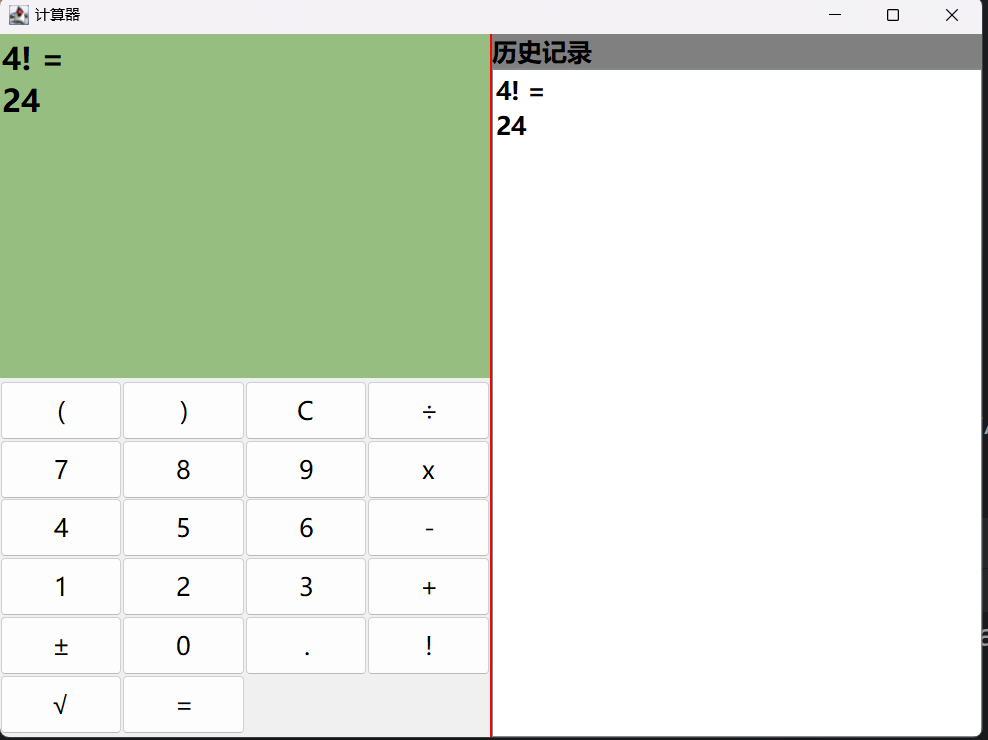
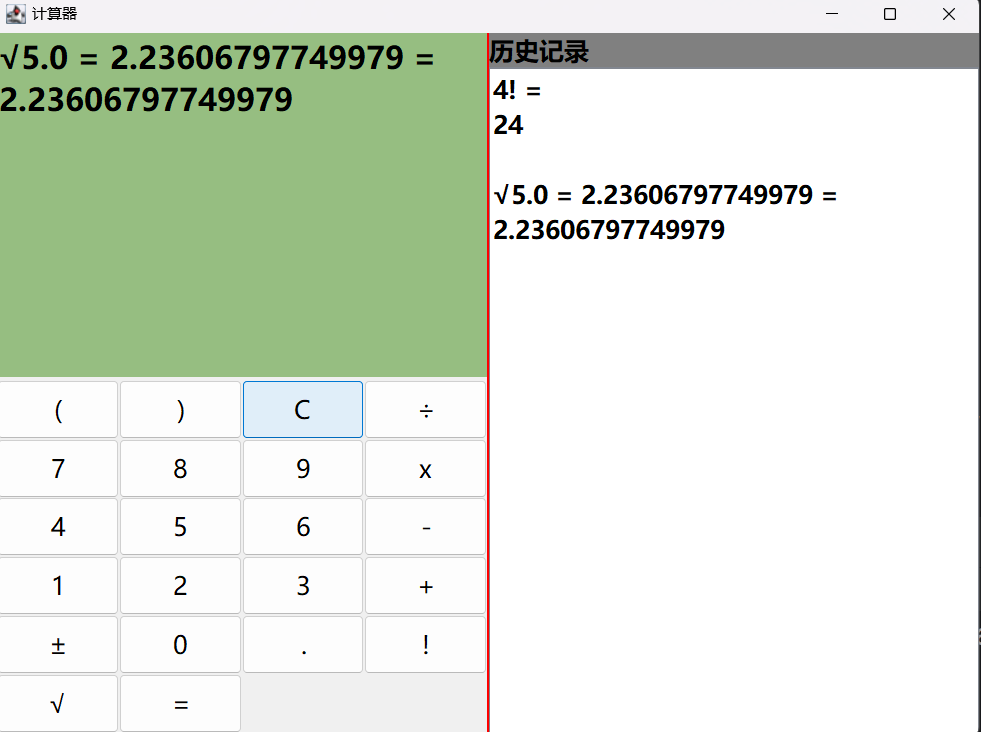

# Java实现的计算器

支持小数的四则运算，整体界面模仿win10系统自带的计算器，但是做了一定的简化。  
添加了阶乘和开方功能，并支持多种运算符的组合。  
负数的输入逻辑和win10保持一致，当你输入完一个数后，点击 ± 就会在这个数前面添加负号。  
## 运行截图
  

  
## 注意事项

1. 输入阶乘或开方后，不能再次输入其他运算符，只能点击=按钮计算结果。
2. 当存在阶乘运算时,应放到最后计算。
3. 阶乘和开方运算完善不全.
